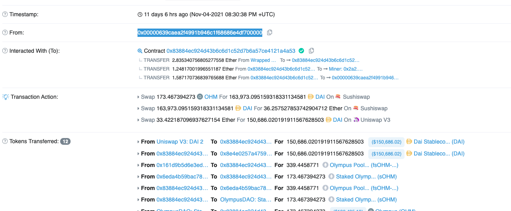
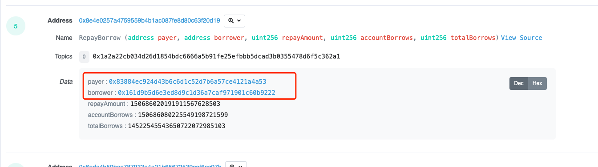
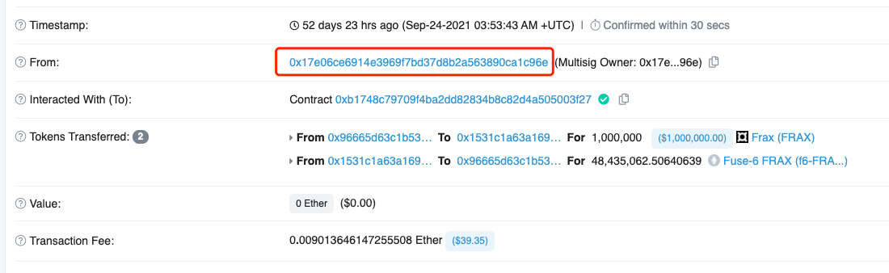
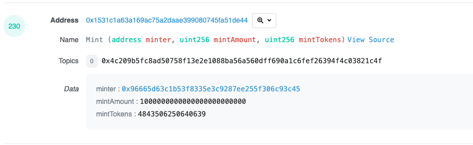

#### 会出现的特别情况：  
1.调起RepayBorrow事件的用户，不是借款用户  
栗子：TX：[0x161e608c5e480a483a1eb54ddc8137691db2d7c8c64fbf662fce4e11968f6fd0](https://etherscan.io/tx/0x161e608c5e480a483a1eb54ddc8137691db2d7c8c64fbf662fce4e11968f6fd0)
  

    

2.Mint事件发起者，不是Minter  
栗子：TX：[0x2bd8f060143b015e76a70373881e71f3ee400053c77197aba4c79203e502b061](https://etherscan.io/tx/0x2bd8f060143b015e76a70373881e71f3ee400053c77197aba4c79203e502b061)  
  

  

3.Redeem事件可能会在Minter事件之前（原因是有其他用户转了fToken给一个新用户，新用户通过fToken Redeem）  

4.Liquidation 中的代还token如果是ETH的话是不会体现在token_tranfer中的，所以就会拿到 token_address 为null的情况，直接用 WETH的地址代替就行