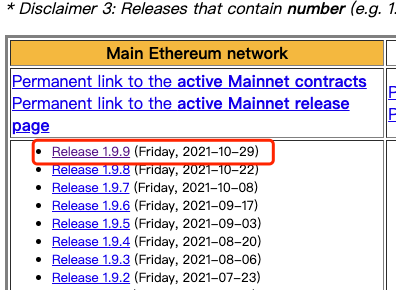
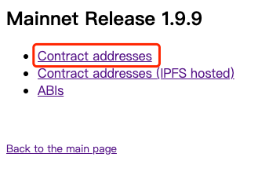
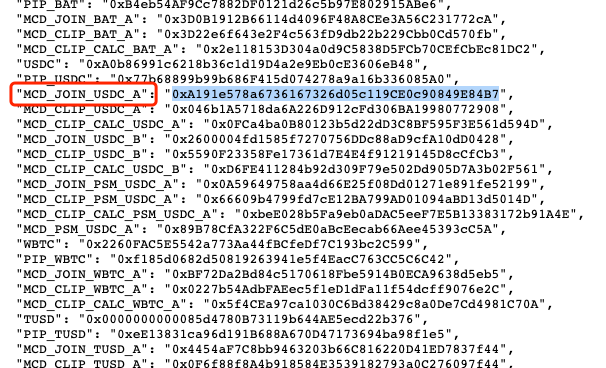

### makerDao的supply与withdraw的查询注意事项
这两个sql中用到`xed-project-237404.footprint_etl.makermcd_collateral_addresses`里面的address作为筛选条件  
而实际上在makerDao，对应的contact地址会随着他的版本更新迭代支持更多的质押币而增多，具体看版本地址：https://changelog.makerdao.com/  
所以不能做到实时更新，如果发现contact地址少了，可以在上面的地址中找到  
最新的版本  
  

点Contract addresses  
  

找到缺失的地址补上(合约名字多为：\*\*\_JOIN_**）
