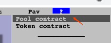

## Pool 数据
在其官方 github 上可以找到所有 Pool 的描述信息

https://github.com/curvefi/curve-contract/blob/master/contracts/pools/3pool/pooldata.json

共 33 个 

都是 V1  版本的

注意 Curve 的合约分为 ZapContract 和 SwapContract

如果存在 ZapContract，则由其负责资金进出
如果不存在 ZapContract，则由 SwapContract 负责资金进出

----

V2 版本的 Pool 没有在 github 上展示，需要想办法

SwapContract 可以在Curve 前端页面获取到，点进 Pool 详情，右上角问号

点击 Pool contract 即可

## 流水解析

### 存入 deposit

[流水](https://etherscan.io/tx/0x082e79a6417616aea5261200335797f4088dc3cba4e1c4b8cdb59c293361f721)

有存入凭证

### 提现 withdraw

[流水](https://etherscan.io/tx/0x614b3fafd2bcd64279ae61701ec0014de2d85ea344bc75760c13af9351d5cfa3)

销毁存入凭证

## 特殊说明
TODO